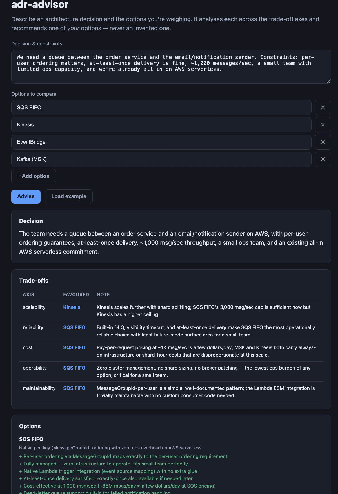
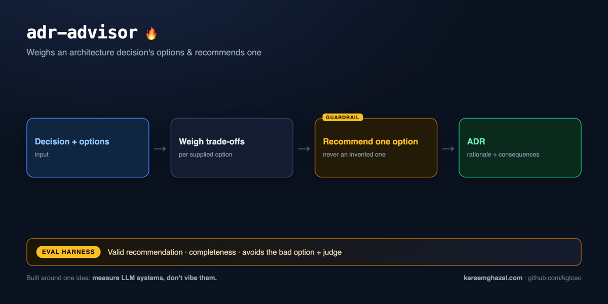

# adr-advisor

### ▶ Live demo: **[adr-advisor.kareemghazal.com](https://adr-advisor.kareemghazal.com)**

Enter a decision and the options you're weighing (or "Load example"), and get the trade-off table,
per-option analysis and a recommendation. (First run ~10–20s.)



**How it works** — input → pipeline → output, with the eval harness that measures it:



An **architecture-decision trade-off advisor**. Give it a decision (with constraints) and the
candidate options you're weighing — it analyses each option across **scalability, reliability,
cost, operability and maintainability**, lays out the trade-offs, and recommends **one of your
options** with the trade-off it's accepting and when to revisit.

It's the decision-making companion to a design reviewer: not "what's wrong with this design?" but
"given these choices and constraints, which one, and why?" — the call a Staff Engineer is paid to
make. The output is the skeleton of an **ADR** (Architecture Decision Record).

The safety guarantee — the same discipline as the rest of these tools — is that **the LLM can't
invent an option.** The recommendation is validated against the options you supplied; a
recommendation that isn't one of them is flagged, and loose names ("SQS" → "SQS FIFO") are
normalised back to the exact option you gave.

## Quickstart

```bash
pip install -e .
cp .env.example .env   # add ANTHROPIC_API_KEY

adr-advisor demo

adr-advisor advise \
  --decision "Queue between order & email service; per-user ordering matters, small team, AWS serverless" \
  --option "SQS FIFO" --option "Kinesis" --option "EventBridge" --option "Kafka (MSK)"
```

## Evals

```bash
python evals/run_evals.py             # validity / completeness / avoids-bad-option + an opus judge
python evals/run_evals.py --no-judge
```

- **Valid recommendation** — always one of the supplied options (never invented). The core guarantee.
- **Complete** — every supplied option is analysed; trade-offs cover the axes.
- **Avoids the bad option** — for cases with a clearly-wrong choice given the constraints (e.g.
  Kafka for a tiny team, synchronous fan-out when the request must return fast), it doesn't pick it.
- **Judge** — opus scores analysis quality, soundness and pragmatism.

**Latest run (claude-sonnet-4-6, opus judge):** all gates pass — 3/3 recommendations are one of the supplied options (SQS FIFO; DynamoDB on-demand; a queue-based async fan-out), never an invented one.

## Tests

```bash
pytest -q   # offline: recommendation validation + normalisation (fake client, no API key)
```

The key test proves that when the model recommends an option you didn't offer, it's flagged
invalid — and that loose/case-variant names are normalised to your exact option.

## Web

`web/` — a Next.js UI: enter a decision + options, get the trade-off table, per-option analysis
and a recommendation.

Run it locally in two terminals:

```bash
# terminal 1 — the API
pip install -e .
cp .env.example .env                  # add ANTHROPIC_API_KEY
python -m uvicorn adr_advisor.api:app --port 8000

# terminal 2 — the UI
cd web
npm install
echo "NEXT_PUBLIC_API_URL=http://localhost:8000" > .env.local
npm run dev                           # open http://localhost:3000
```

See [DEPLOY.md](./DEPLOY.md).

## License

MIT — see [LICENSE](./LICENSE).
